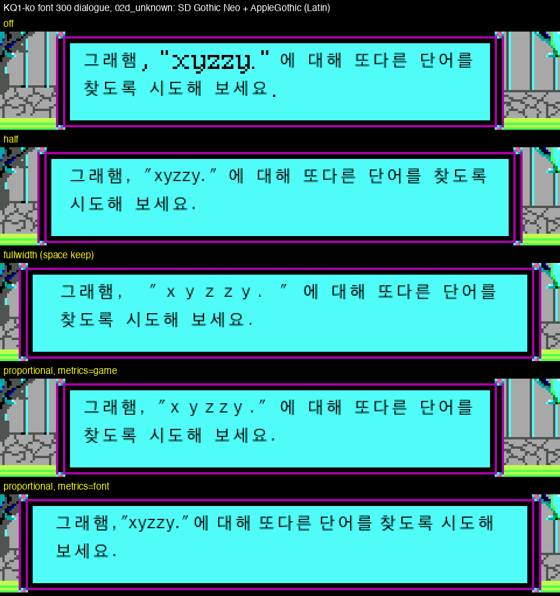
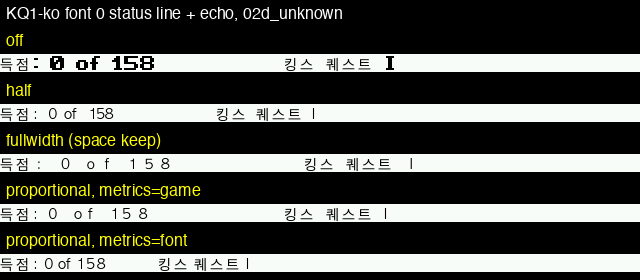
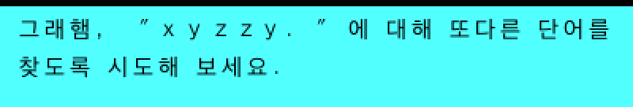
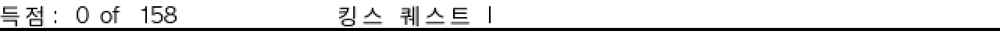

# `hires_text.map`: a translator's and font-pack author's guide

This is the file a translation or a hi-res font pack ships to control how
ScummVM draws replacement (TrueType or SVFN) text over a game's own bitmap
fonts. The same file and the same parser serve every engine that has the
path (C11, `I18N_TEXT_DESIGN.md`); what each engine reads is in its own
section below:

- **SCI16** (below SCI2): when the game's text is a UTF-8 translation
  (`sci-<lang>.str` present, or the KQ1-ko detection entry) or a legacy CJK
  code page (949/932/936/950) - the same scope as the `hires_text_font` ini
  key. On any other SCI game the map is ignored, with one warning.
- **SCUMM** v1-v6 with the hi-res text layer on.
- **AGS**, when the game directory has `hires_text.map` or the ini names
  one (`hires_text_map=`).
- **Grim** does not read the map: a translation names one face per game
  font in `<font>.laf.txt` (see "Localising a game with a UTF-8 text file"
  below).

Anyone localising a game should start at "Localising a game with a UTF-8
text file" and "One map, three languages"; the rest of the page is the
reference.

For the surrounding architecture (the text compositor, the TextLayer, why
this exists at all) see `HIRES_COMPOSITOR_DESIGN.md`. This page is only
about the map file: its syntax, precedence, the modes it can select, and
the warnings a bad map produces.

## Where it lives

- `hires_text.map` in the game's own directory, or
- the file named by the ini key `hires_text_map` (game domain).

An empty `hires_text_map=` names nothing (one warning, no map is used,
the game directory's own `hires_text.map` is *not* tried instead). A
missing file, a directory, or text that does not parse as INI each give
one warning and the map is ignored entirely - the game still starts and
draws with whatever the ini keys and built-in defaults say.

It is plain INI syntax (`common/formats/ini-file.h`): `[section]` headers,
`key=value` lines, `;` comments on their own line. **Inline comments are
also supported now, on every key the parser reads:** a `;` preceded by a
space or a tab ends the value there (the rest is dropped, and what is left
is trimmed again), so `color=0 ; DOS` parses as `0`. A `;` with anything
else before it stays part of the value - `single=my;font.fnt` keeps its
`;`. The one edge case outside "a value with a whitespace-`;` parses as
before": `key=;x` also reads as empty, even though nothing in that raw
line has whitespace before the `;` - the semicolon sits at the very start
of the value, and that alone ends it, the same as `key= ; note` does once
the leading space is trimmed away. `#` is never an inline comment marker,
and this rule is the map's own - `scummvm.ini` (read by `ConfigManager`)
has no inline comments at all. Comments still read best on their own line,
above the key they describe, and every own-line example on this page
keeps doing exactly that.

**Relative paths in the map are the map's own.** A `[fonts]` entry, or a
path written in place of a face name (`face=`, `latin_font=`, ...), that
is not absolute is taken against the directory holding the map file. For
the game directory's own `hires_text.map` that is the game directory; for
a map named by `hires_text_map=` elsewhere, fonts can sit beside that map.
The ini keys `hires_text_font` and `hires_text_latin_font` are not map
paths: they are used exactly as given, as they always were.

## Localising a game with a UTF-8 text file

Since C11 (`I18N_TEXT_DESIGN.md`) the engines below take a translation as
**UTF-8 text in a file named by the language code**, and draw it in any
script the fonts cover - Korean, Japanese, Thai - with the same engine code
and the same map. Only the text file changes between languages. The
language is the one the player picks (`language=` in the game's ini domain
or `--language=`); its code is ScummVM's (`ko`, `ja`, `th`, `vi`, ...).
Korean fan patches in their old formats (CP949 `korean.trs`, EUC-KR
`korean.tra`, CP949 `grim.ko.tab`, the SCI `.uni` bundle) keep working as
before; they are legacy formats, not the model for a new translation.

| Engine | Text file(s) | What marks it UTF-8 | Fonts |
|---|---|---|---|
| **SCI16** | the game's TEXT resources as `text.NNN` patch files with UTF-8 strings (`harness/i18n/m12mkpatch.py`), plus `sci-<lang>.str` for strings compiled into scripts (`SCRIPT_STRINGS.md`) | **`sci-<lang>.str` present for the chosen language** - the manifest; it may hold only comments when no script string needs translating. KQ1-ko is also recognised by its detection entry | `hires_text.map` in the game directory: `[hires] face=` (a chain), per font id `[font.N]`; then an optional `.uni` bundle; then the game's font |
| **SCUMM** v1-v6 (PC renderers) | `<lang>.trs` (`ja.trs`, `th.trs`, `ko.trs`; Korean also finds the legacy `korean.trs`) - the `SCVMTRS` bundle with UTF-8 strings (`harness/i18n/c11/mktrs.py` writes one on an existing bundle's index) | **`EF BB BF` at the start of the string body** (after the room table; the file itself starts with `SCVMTRS `), or ini `text_encoding=utf8`. An unmarked body that looks like UTF-8 logs one hint | `hires_text.map`: `[hires] face=` chain, `[font.N]` per charset, `[font.N] bitmap=` SVFN; after the chain, the game's charset (which draws non-ASCII characters as `?`) |
| **AGS** | `<name>.tra` compiled from the AGS editor's `.trs` (`harness/i18n/c11/mktra.py` writes one without the editor), selected by `[language] translation=` in `acsetup.cfg` or `--language=` | the `.tra`'s own `ext_sopts` option **`encoding=utf-8`** (upstream AGS). Without it, a file named `korean` is read as EUC-KR (legacy) | `hires_text.map` (see "AGS (C11 T8)"): `[font.N] face=` chains or `[font.N] bitmap=` SVFN per AGS font; otherwise the game's own fonts |
| **Grim** (retail, not remastered) | `grim.<lang>.tab` beside `GRIM.TAB`, same keys (`harness/i18n/c11/mkgrimtab.py`); the data dir needs `gfupd101.exe` | **`EF BB BF` as the file's first bytes** (text starts at byte 3). Without it, `grim.ko.tab` is the legacy CP949 table | one `<font>.laf.txt` per game font, one line `"<face file> <N>px"` (e.g. `ComicSans18.laf.txt`: `hiragino-w3.ttc 17px`); no chain, no map |

What to expect, and what to check:

- **Detection.** SCI and SCUMM detect the original game as before. Grim
  with a forced language whose `grim.<lang>.tab` exists is accepted by a
  fork-only fallback detection; without the file the game is not
  identified at all. AGS needs nothing.
- **Fonts: one map for every language.** Name the faces once as a chain,
  `face=ko, ja, th`; each character is drawn by the first face that has it
  ("One map, three languages" below). A TTC file opens its face 0 only:
  extract another face first (`harness/i18n/c11/ttc2ttf.py`). For Thai
  choose a face whose marks have zero advance and a negative bearing
  (Sukhumvit Set; **not** Thonburi, which needs shaping).
- **Coverage warnings.** With a UTF-8 translation, SCI, SCUMM and AGS
  sample 64 of the translation's own characters and check every face of
  the chain: one warning per face, e.g.
  `hires text: <face> lacks 54 of 54 sampled characters of the translation
  (U+0E01 U+0E02 ...); they fall back to the game's font`, and
  `hires text: <face> draws combining marks as spacing glyphs (it needs
  shaping); choose a face with zero-width marks, e.g. Sukhumvit Set`. A
  warning that names the last face means those characters will not show.
  Grim does not check coverage and has no fallback face: a character
  its face lacks is drawn as that face draws a missing glyph.
- **Line breaking** is the shared rule set: at spaces, before and after
  kana/kanji (kinsoku: no line starts with `。` `」` and similar, none ends
  with `「`), between Thai syllables (no dictionary; a word may be split),
  never inside a character with its marks. `[layout]` in the map changes
  the defaults (`hangul=word|any`, `kinsoku=on|off`, `thai=on|off`). Grim
  has no map and so always uses the defaults.
- **Size.** Thai stacks marks above and below the base, taller than a
  Latin or Hangul line. When the face is fitted to the game's line cell
  (SCI, SCUMM, and AGS without `size=`), it is opened smaller so the marks
  fit (about 0.75x); a map `size=` sets the size explicitly.
- **Not supported:** right-to-left scripts, scripts that need shaping
  (Arabic, Indic), dictionary line breaking (Thai words may split),
  typing translated text into the game's parser.

## One map, three languages

One `hires_text.map`, shipped once, serves a Korean, a Japanese and a Thai
translation of the same game. Swapping the translation file is the only
change; the map is not edited. This is the map the C11 captures used
(`harness/i18n/c11/maps/universal.map`; macOS system paths, for testing -
ship your own faces beside the map and name them relative to it):

```ini
[hires]
; a chain: each character is drawn by the first face that has it
face=ko, ja, th

[fonts]
ko=/System/Library/Fonts/AppleSDGothicNeo.ttc
ja=/System/Library/Fonts/ヒラギノ角ゴシック W3.ttc
; face 2 ("Text") of SukhumvitSet.ttc, extracted: a .ttc opens face 0 only
th=sukhumvit-text.ttf
```

With a Japanese translation, kana and kanji that AppleSDGothicNeo has are
drawn by it, and the rest fall through to Hiragino (the coverage check
logs how many: "AppleSDGothicNeo.ttc lacks 6 of 63 ... they fall back to
ヒラギノ角ゴシック W3.ttc"). Put `ja` first to have Japanese drawn by the
Japanese face. With the Thai translation both CJK faces lack every Thai
character and Sukhumvit draws them. The same file works on:

- **SCI** (KQ1): as is.
- **SCUMM** (MI1 UTE): add `scale=2` to `[hires]` (without a scale the
  text is drawn at 8 px). Since C17 a map whose fonts carry coverage (a face
  or an 8 bpp bitmap) blends without `alpha=true`; write `alpha=false` for
  hard edges. v7 games cannot blend and stay keyed. A game whose
  charsets differ in height should give sizes per charset with
  `[font.N] size=`.
- **AGS** (5 Days a Stranger): add `[font.0]`, `[font.1]`, `[font.2]`
  sections with the same `face=ko, ja, th`, or rely on `[hires] face=`,
  which AGS also applies to fonts without a section.

Per-engine captures of this map with the three translations are in
`I18N_TEXT_DESIGN.md` §9.

### Face chains, `[font.N] bitmap=` and `[layout]` (every engine)

- **`face=` is a face or a comma-separated chain**, in `[hires]` and in
  `[font.N]` (`font=` is the same key). Each entry is a `[fonts]` name or
  a path (relative paths are the map's own).
- **The bare-name rule.** A value **without a comma** is one face, taken
  as a `[fonts]` name or else as a path, as before chains existed - so
  `face=Osaka` alone opens a file called `Osaka` in the map's directory.
  **Inside a chain** an entry that is not a `[fonts]` name counts as a
  path only if it contains `/`, `\` or `.`; a bare extension-less name
  there (`face=ko, Osaka`) is dropped with one warning ("[hires] face
  'Osaka' is no [fonts] name and no path, dropping it from the chain"),
  and an empty entry (`face=ko,,ja`) is skipped with one warning. Name
  faces in `[fonts]` and chain the names.
- **After the chain** comes the engine's own fallback: SCI the `.uni`
  bundle (presented in the chain's cell), then the game's font; SCUMM the
  game's charset; AGS the game's own font N, character by character.
- **Faces in one chain are fitted separately**, each to the same cell;
  two faces on one line may not share a baseline exactly.
- **`[font.N] bitmap=`** names an SVFN font for font/charset N, relative
  to the map. SCUMM tries it before the faces; AGS draws it instead of any
  face. SCI parses the key but does not use it.
- **`[layout]`** (optionally `[layout:<gameid>]`): `hangul=word|any`,
  `kinsoku=on|off`, `thai=on|off`. Defaults: SCI `word/on/on`, SCUMM
  `any/on/on` (the Korean patches' own rule), AGS `word/on/on`. An unknown
  key or a bad value is one warning and keeps the default. It applies to a
  UTF-8 translation (and, on AGS, to EUC-KR text and to map fonts); legacy
  code-page text keeps the engine's own breaker.

## A complete, worked example: KQ1-ko

KQ1-ko draws three kinds of text, each its own SCI font id (found with the
diagnostic `hires_text_log` ini key; see `HIRES_COMPOSITOR_DESIGN.md`
§5.2 for how):

| Font id | What it draws |
|---|---|
| `0` | Status line, menu bar, parser echo ("득점: 0 of 158", "File", "look") |
| `4` | Title screen and its menu ("게임시작", "이어서 계속하기") |
| `300` | Dialogue and narration boxes - the text players spend the most time reading |

Here is a map that was built and verified against exactly this game (the
face paths are macOS system fonts, used for local testing; ship your own
TTFs alongside the map instead):

```ini
[hires]
; the face for a [font.N] section that names no face of its own
font=default

; face name -> file. Relative paths are taken against the directory
; that holds this map file.
[fonts]
default=/System/Library/Fonts/AppleSDGothicNeo.ttc
latin=/System/Library/Fonts/Supplemental/AppleGothic.ttf

; the default for every font id below, unless overridden
[latin]
; draw the Latin range in the "latin" face, not "default"
face=latin

; the dialogue box: most text, so fullwidth reads best
[font.300]
; "xyzzy" becomes "ｘｙｚｚｙ", same cell width as before
latin=fullwidth

; the status line / menu bar / parser echo: short, narrow font
[font.0]
; "0 of 158" draws in AppleGothic at its own narrow width
latin=half

; font 4 (title/menu) has no [font.N] section here, so it stays off -
; its Latin text (none, in KQ1-ko - the title screen is already Korean)
; is drawn by the game's own font, as if there were no map at all.
```

With this map and *no* `hires_text_latin*` ini keys at all, font 300 and
font 0 draw in two different Latin modes from one file - something the
ini keys alone cannot do, since they apply the same mode to every font id.
This is the exact map used for the per-font-id captures below.

A second worked example, this time for proportional Latin (see "Modes"
below for what that means): give every font id `metrics=game` (identical
line breaks to today) except the dialogue box, which switches to the
TrueType face's own advances:

```ini
[latin]
mode=proportional
face=latin
; the default for every font id: keep today's layout
metrics=game

[font.300]
; the dialogue box alone follows AppleGothic's own widths
metrics=font
```

## Precedence

Every setting (face, size, Latin mode, Latin face, space handling,
metrics) is resolved independently, in this order, most specific first:

1. **The matching ini key** (`hires_text_font`, `hires_text_font_size`,
   `hires_text_latin`, `hires_text_latin_font`, `hires_text_latin_space`,
   `hires_text_metrics`) - global, and wins over the map entirely for
   that setting, on every font id at once.
2. **`[font.N:<platform>]`**, then **`[font.N]`** - settings for one SCI
   font id. `<platform>` is ScummVM's platform code (`pc98`, `dos`, ...);
   the qualified section wins only on that platform, key by key, so a
   `[font.0]` and a `[font.0:pc98]` can each set different keys and both
   apply.
3. **`[latin:<platform>]`/`[latin]`** for Latin mode, Latin face, space
   and metrics; **`[hires:<platform>]`/`[hires]`** for the face and size
   a `[font.N]` did not itself name.
4. **The built-in default**: size 16, Latin off, space keep, metrics
   game, no separate Latin face (the main face draws everything).

So a map that names nothing for a font id reproduces today's behaviour
for it exactly - the map only ever adds settings, never a game-wide
override; an ini key is the only thing that can override every font id at
once.

One legacy shorthand, kept for compatibility with SCUMM maps: `[latin]
enabled=true` means "the engine's usual Latin behaviour", which for SCI is
`latin=proportional` (its metrics follow the usual chain, so `game`
unless a `metrics=` says otherwise). It is decided per font id, as the
last step before the default: a font id whose mode is set by the ini key
`hires_text_latin`, by its own `[font.N] latin=`, or by `[latin] mode=`
takes that mode; every other font id gets proportional. So one
`[font.4] latin=off` turns font 4 off and leaves the alias in force for
the rest. SCUMM's `bitmap=` key also implies `enabled` on
SCUMM, but SCI has no bitmap Latin path - a map with only `bitmap=` gets
one warning and no effect (see "Warnings" below).

## Sections and keys

| Section | Key | Meaning |
|---|---|---|
| `[hires]` | `font=` (or `face=`) | The face a `[font.N]` that names none falls back to - a `[fonts]` name, or a path |
| `[hires]` | `size=` | Pixel size, same fallback role |
| `[fonts]` | *name*`=`*file* | Face name -> file, referenced by `font=`/`face=`/`latin_font=`/`latin_face=` elsewhere. Case-insensitive names; relative paths are taken against the directory holding the map |
| `[latin]` | `mode=` | `off` \| `half` \| `fullwidth` \| `proportional` - the default for every font id |
| `[latin]` | `font=` (or `face=`) | Face for the Latin range; absent means the font's own face draws it |
| `[latin]` | `space=` | `keep` \| `fullwidth` (fullwidth mode only) |
| `[latin]` | `metrics=` | `game` \| `font` (proportional mode only) |
| `[font.N]` | `face=` (or `font=`) | Face for this font id |
| `[font.N]` | `size=` | Pixel size for this font id |
| `[font.N]` | `latin=` | Overrides `[latin] mode=` for this font id |
| `[font.N]` | `latin_font=` (or `latin_face=`) | Overrides `[latin] font=` for this font id |
| `[font.N]` | `latin_space=` | Overrides `[latin] space=` for this font id |
| `[font.N]` | `metrics=` | Overrides `[latin] metrics=` for this font id |

`[font.N]` must be written exactly that way - a numeric id, `[font.4]`,
optionally `[font.4:pc98]`. `[font.04]` or `[font.4:]` (an empty
qualifier) are rejected with a warning, not silently treated as `[font.4]`.

### The same keys on SCUMM (C11 T6)

SCUMM (v1-v6, hi-res text layer) reads the keys of the table above with the
same meanings, with these differences
(`engines/scumm/HIRES_TEXT.md`, "Per-charset faces and per-glyph placement"):

| Key | SCUMM |
|---|---|
| `[font.N]` | `N` is the SCUMM **charset id**, 0..19 (not an SCI font id) |
| `[font.N] bitmap=` | an SVFN for that charset, relative to the map, tried before its faces |
| `[hires] face=`, `[font.N] face=` | a face or a comma-separated chain; the first face with the character draws it, then the game's font. Else `[fonts] default=`; the ini `hires_text_font` overrides all |
| `[hires] size=`, `[font.N] size=` | the characters' pixel size (as SCI); without one, the face is opened at the game cell times the scale, its line filling the cell (as before). `[hires] size=` applies to every charset: a game whose charsets have different cell heights (MI1's 16-px sentence line beside its dialogue) should use `[font.N] size=` per charset |
| `[latin] mode=`, `[font.N] latin=` | `off`/`half`/`fullwidth`/`proportional` as on SCI; the **default is `proportional`** (SCUMM always drew ASCII with the replacement); `[latin] enabled=false` means `off` |
| `[latin] metrics=`, `[font.N] metrics=` | ASCII under `proportional`: `game` = the game's width, `font` = `latinAdvanceGamePx()` of the face's advance. `[font.N] metrics=` also sets wide and other glyphs for that charset; the ini `hires_text_metrics` wins over both |
| `[render] metrics=` | unchanged: wide glyphs (Hangul, kanji) keep the cell rule with it |

Glyphs are placed by their own metrics: a wide glyph keeps the game's cell
rule (a legacy layout does not move), a combining mark advances 0 and is
drawn against the previous base, every other glyph advances by the face
(`metrics=font` unless a key says `game`), and a glyph under
`metrics=game` is centred in its game cell. With a translation loaded,
each face is checked against 64 of its code points (one warning per face).
A SCUMM map with none of `[hires] face/size`, `[font.N]` and
`[latin] mode/space` is read exactly as before.

**Not yet implemented**, though a map that already has them for SCUMM
will not warn: `baseline=`, and `[hires] scale=` beyond what the
compositor already fixes. Per-glyph kerning/centring in proportional
mode and the legacy SJIS face are also not implemented yet.

**`[glyphs]` is parsed, but not yet applied on SCI.** The shared parser
(`graphics/hires_text/font_map.cpp`) reads single codes, `keep`, ranges
(`0x21-0x7E=+0xFEE0`), scopes (`[glyphs:cs1]`) and qualified sections the
same way for both engines, so a bad entry - including a bad range - gives
the same warning on an SCI map as it would on a SCUMM one (see "Warnings
to expect" below). SCI just does not act on the resulting table yet: every
game still draws its own glyphs for the codes a `[glyphs]` section covers.

### Outline and shadow: `[shadow]` (SCUMM v1-v6, C19)

The outline is built from the glyph's coverage, whatever the source (TrueType,
an 8 bpp bitmap, a 1 bpp patch font), so it works the same for Korean,
Japanese and Thai. By default it is round and antialiased, 0.75 x scale wide
(1.5 output pixels at 2x). On a blended 32-bit screen it goes on a layer of its
own under the text, so the text's antialiased edge sits on the outline with no
seam. On a keyed 8-bit screen (v7, `alpha=false`, FM-Towns, Mac v3) it is
solid. Every length is in output pixels.

```ini
[shadow]
mode=game           ; game (default) | none | drop | outline | stroke
color=0             ; outline colour (palette index)
width=1.5           ; outline radius in output px, to a quarter (0..8)
style=round         ; round | square | legacy (the pre-C19 binary look)
offset=2            ; shadow distance; also the width when width= is absent
shadow=-1,1         ; a shadow of the outline at dx,dy output px; none = off
shadow_color=0      ; defaults to color
shadow_alpha=60     ; 0..100 on a blended screen; keyed: >= 50 solid, else none
```

`mode=game` follows the game. With a kor-trs v1-v6 patch that is byte 1 of the
charset's `korean%02d.fnt`, where `s` is the scale:

| byte | patch renderer | hi-res layer |
|---|---|---|
| 1 | none | none |
| 0, 4 and up | 8-direction outline | round outline, 0.75 x s wide |
| 2 | drop (1,1) | drop of the glyph's coverage by s/2, rounded up |
| 3 | outline + lower-left | the outline plus a copy moved (-s/2, +s/2) |

A game with no patch font (English, a UTF-8 translation) draws nothing under
`mode=game`. v7 (Full Throttle, The Dig, COMI) draws no decoration.

Existing maps change look: an `offset=N` map now gets a round N px outline
instead of the old square ring; `style=legacy` brings the old one back, without
the gaps it had above 1 px. Engine-side detail:
`engines/scumm/HIRES_TEXT_DECORATIONS.md` and `graphics/hires_text/README.md`
("Decoration (C19)").

### Heavier text: a heavier face, or `[hires] gamma=` (C20)

Thin faces look grey once text is blended over an outline (MI2 Korean in
Apple SD Gothic Neo Regular). Prefer a heavier face: on macOS,
AppleSDGothicNeo.ttc face 6 is Bold, which C20 measured as the best
default for Korean (mean text level 190 against Regular's 171, and dense
syllables such as 췄 떡 밥 stay open). Until a map can name a face inside
a `.ttc` (card C21), extract it with
`harness/i18n/c11/ttc2ttf.py /System/Library/Fonts/AppleSDGothicNeo.ttc 6 sdgothic-bold.ttf`
and point `ko=` at the file. Apple's fonts may not be redistributed, so
this is for local maps.

For a script whose only face is light, `[hires] gamma=` (0.5 to 4, default
1 = off) raises TrueType coverage as `255 * (c/255)^(1/gamma)` when a glyph
is rasterised; coverage below 4 is left alone. It applies to the whole face
chain on SCUMM, SCI and AGS; Grim and SVFN or baked bitmap fonts ignore it.
Outlines widen with the body (about +0.23 px at 2.2), and on a keyed
(8-bit) screen more pixels cross the ink cut, so keyed text gets heavier.
Omitting the key leaves every existing map byte-identical.

### SCI with a UTF-8 translation (C11 T5)

On SCI16 the map (and the `hires_text_*` ini keys) apply when the game's
text is a **UTF-8 translation** or the game is in a legacy CJK code page
(949/932/936/950); the game's language does not decide it. A UTF-8
translation is recognised by:

- a detection entry marked UTF-8 (KQ1-ko), or
- **`sci-<lang>.str` present in the game directory for the chosen
  language** - the translation's manifest; it may hold only comments.
  The rule also asks for `language=` in the game's ini domain, but a game
  added through the launcher always has one (the detected language), so
  in practice **the manifest alone decides**: a stray `sci-en.str` beside
  an English game turns the UTF-8 path on for it. Name the file for the
  language the translation is in, and set `language=` to that language.

With a translation loaded:

| Key | SCI |
|---|---|
| `[hires] face=`, `[font.N] face=` | a face or a comma-separated chain; the first face with the character draws it, then the `.uni` bundle (presented in the faces' cell), then the game's font. Each face is checked against 64 of the translation's code points: one warning per face naming what it lacks, or that it draws combining marks as spacing glyphs |
| `[hires] size=`, `[font.N] size=` | as before; font ids with the same chain at different sizes get separate chains |
| `[layout] hangul=`, `kinsoku=`, `thai=` | line breaking of the translation: defaults `word`, `on`, `on` (SCI always broke Hangul at spaces) |

Glyphs beyond ASCII are placed by their own metrics: a glyph the face keeps
in two cells (Hangul, kana, kanji) keeps the cell rule, a combining mark
advances 0 and is drawn against the previous base, any other glyph
advances by the face's own advance. A game **without** a translation (a
legacy Korean or Japanese release, a `.uni` bundle) keeps the cell widths
of its fonts to the pixel.

**Where there is no text plane.** The UTF-8 path needs the upscaled
graphics driver (the text plane). The driver table still matches platform
rows first, as it does for Korean today: a UTF-8 translation of a Windows
SCI1.1 release, or of KQ6 on DOS with hi-res graphics on, takes that
platform's own driver, which has no text plane - its glyphs are not shown
(one warning: "the graphics driver for this game ... does not composite
the text layer"). Use the DOS release, or turn hi-res graphics off.

### AGS (C11 T8)

AGS reads the map only when the game directory has `hires_text.map` or the
ini names one with `hires_text_map=`; its sections are qualified by the game
id (`[font.0:5daysastranger]` before `[font.0]`). `N` in `[font.N]` is the
AGS font number. Without a map and without `hires_text_font`, every font is
the game's own (`agsfntN.ttf`/`.wfn`, plus a Korean patch's `extfntN.wfn`).

| Key | AGS |
|---|---|
| `[font.N] bitmap=` | an SVFN font for font N, relative to the map; wins over every face |
| `[font.N] face=`, ini `hires_text_font`, `[hires] face=`, `[fonts] default=` | in this order, the first that is set: a face or a comma-separated chain; the first face with the character draws it, then the game's own font N (character by character, so a run the chain lacks loses the game font's kerning) |
| `[font.N] size=`, ini `hires_text_font_size`, `[hires] size=` | pixels; without one, the game font's height |
| `[hires] alpha=` | default `true`: coverage is blended into 16/32-bit games; `false` (and 8-bit games) draw a pixel where coverage is at least half |
| `[layout] hangul=`, `kinsoku=`, `thai=` | line breaking, defaults `word`, `on`, `on`. Breaking goes through the shared layout stage only for a UTF-8 translation, an EUC-KR (Korean patch) translation, or while the map names fonts; an English or native UTF-8 game without either keeps AGS's own breaking |

With a UTF-8 translation, each face is checked against 64 of its code points
(one warning per face). A translation with combining marks (Thai) whose
game fonts are TTFs drawn by alfont gets one hint to add a map: alfont clips
the marks above the line and places them after their base.

Details worth knowing on AGS (C11 T8 review, `[source]` in
`engines/ags/shared/font/hires_font_plan.cpp` and
`engines/ags/engine/ac/translation.cpp`):

- **The face order is `[font.N] bitmap=` > `[font.N] face=` > ini
  `hires_text_font` > `[hires] face=` > `[fonts] default=`.** So on AGS,
  unlike SCI and SCUMM, a map's own `[font.N] face=` beats the ini key.
  The unit tests pin each step alone and `[fonts] default=` alone; the
  pair `[hires] face=` + `[fonts] default=` in one map is not covered by a
  test (the code takes `[hires] face=`).
- **What turns the map fonts on** (and with them the shared line
  breaking of UTF-8 text): a map with any `[font.N]` section, a non-empty
  `[hires] face=`, or `[fonts] default=` - **or the ini key
  `hires_text_font` alone, with no map at all**. A native UTF-8 game (no
  translation) with only that ini key therefore breaks its lines with the
  shared stage, not AGS's own loop.
- **A `.tra` that fails to open still counts as "a translation is
  loaded"** for that gate: AGS sets the translation name before it opens
  the file and does not clear it on failure (upstream behaviour, kept).
  Only a native UTF-8 game is affected (it then breaks lines with the
  shared stage); an ASCII game is not, and its text is unchanged.

### `[glyphs]` ranges

A range remaps or keeps many codes in one line, instead of one `[glyphs]`
entry per code:

```ini
[glyphs]
; ASCII to the fullwidth forms block, all at once
0x21-0x7E=+0xFEE0
; the caret in that range stays the game's own ellipsis
0x5e=keep
; a whole block left to the game's font
0x80-0x9F=keep
; a single code, offset form - same as 0x41=0x61
0x41=+0x20
```

- The key is `<code>-<code>`: each half is hex `0x..` or decimal (never
  `u+` - a range key can only ever be a plain code range, since
  `Common::INIFile` rejects a `u+` key, and the whole map with it, exactly
  as a single `u+`-keyed entry already does).
- The value is `keep` (leave the whole range untouched) or `+<n>` (remap
  every code in the range by the same offset; `n` is `0x..` or decimal,
  never `u+` - an offset is a distance, not a code point).
- `+<n>` also works on a single code: `0x41=+0x20` is the same as
  `0x41=0x61`.
- **Bounds**, each one warns and ignores just that one entry: a range must
  not end before it starts (`end < start`); its end must not exceed
  `0xFFFF`, since game codes are at most double-byte (a single code's
  target keeps its own `U+10FFFF` cap); `end + offset` must not exceed
  `U+10FFFF`; a malformed half (`0x21-`, `-0x7E`, `0x21-0x7E-0x80`,
  `0xzz-0x7E`) is rejected the same way. A range cannot take an absolute
  (`u+`) target - `0x21-0x7E=u+FF01` is refused, because it would draw 94
  different codes as one glyph.
- **Table limit:** ranges may add at most 131072 codes per map load,
  counted over the common table and every scope together (two full
  `0x0000-0xFFFF` ranges' worth). A range that would cross the limit is
  ignored whole, with one warning; ranges earlier in the file still apply.
  Single-code entries never count against this limit.
- **Precedence**, most specific wins:
  1. **Across sections, unchanged:** a qualified section (`[glyphs:cs1]`)
     beats the bare `[glyphs]` section for the codes it names, whether the
     entry is a range or a single code.
  2. **Within one section, a single code always beats a range that covers
     it, whatever order the lines are written in** - that is how
     `0x5e=keep` above punches a hole in the `0x21-0x7E` range next to it,
     even though it comes after it.
  3. **Between two ranges in the same section, the later line wins** for
     the codes they share.
  4. Overlaps never warn: a hole punched in a range and a narrower range
     layered over a wider one are both intended uses.

The exact warning text for each bound and for the table limit is in
"Warnings to expect" below.

### The ini keys, and what they override

| ini key | Overrides |
|---|---|
| `hires_text_font` | The face path, for every font id. On **SCI and SCUMM** it beats `[font.N] face=` too, not only `[fonts] default`/`[hires] font=`. On **AGS** it does not: `[font.N] bitmap=` and `[font.N] face=` win over it, and it wins over `[hires] face=` and `[fonts] default=` (see "AGS (C11 T8)"). On AGS the key alone (no map file) also turns the map-font renderer on, and with it the shared line breaking of UTF-8 text |
| `hires_text_font_size` | The size, for every font id (8..64) |
| `hires_text_latin` | The Latin mode (`off`/`half`/`fullwidth`/`proportional`), for every font id |
| `hires_text_latin_font` | The Latin-range face, for every font id |
| `hires_text_latin_space` | The space handling (`keep`/`fullwidth`), for every font id |
| `hires_text_metrics` | The metrics source (`game`/`font`), for every font id |
| `hires_text_map` | Which map file is read, instead of `hires_text.map` |
| `hires_text_log` | Diagnostic: logs each line drawn and which face drew each glyph (used to build the font-id table above) |

These are meant for a player overriding a translation's choices (or for
testing), not for the translation itself - a map is the only way to give
different font ids different settings.

#### Display key: `hw_screen_32bpp`

| ini key | Effect |
|---|---|
| `hw_screen_32bpp` | `true`: ScummVM's *SDL Surface* graphics mode (`--gfx-mode=surfacesdl`, SDL2 or SDL3) presents through a 32-bit screen for every game, instead of a 16-bit RGB565 one. Default `false` |

This key is not a map override and is not SCI-specific. It belongs to the
display backend and can go in a game's section or in `[scummvm]`. You
usually do not need it. A game that asks for 32-bit colour already gets the
32-bit screen. That includes Korean/Japanese SCI with `rgb_rendering`, SCUMM
with `hires_text_alpha` and 32-bit AGS games. Set it when a 16-bit or
paletted game should skip the 5/6/5-bit rounding, e.g. for colour-exact
screenshots or frame dumps. Its visible effect is small: palette colours
are up to 7/255 per channel more accurate. The OpenGL graphics mode (the
default on most desktops) is always 32-bit and ignores the key. Details:
`HIRES_COMPOSITOR_DESIGN.md` §5.4.

## Modes, with pictures

All five captures below are the same KQ1-ko dialogue box and status line
(`02d_unknown`), with only the Latin mode changed, at 2x.




- **`off`** - the game's own bitmap font draws the Latin text (`xyzzy`),
  exactly as today. Default when a font id has no map entry at all.
- **`half`** - ASCII is routed to the replacement TrueType face, at that
  face's own narrow advance, same as the CJK glyphs' "half-width" role.
  Layout is unaffected because CJK games' own Latin glyphs are already
  narrow.
- **`fullwidth`** - ASCII is remapped to the Unicode fullwidth-forms block
  and drawn at the same (wide) cell CJK characters use, so a run of Latin
  text lines up with the surrounding Hangul/Kanji/Hanja - "xyzzy" becomes
  "ｘｙｚｚｙ". `space=fullwidth` also remaps the space character to the
  wide ideographic space (U+3000); `space=keep` (the default) leaves
  spaces at their normal width, which is why the boxes above show narrow
  gaps between fullwidth letters.
- **`proportional`, `metrics=game`** - ASCII is routed to the TrueType
  face (as `half` is), but each character advances by the *game font's
  own* width for that character, not the TrueType face's. Line breaks and
  box sizes come out pixel-identical to `off` - this is the mode to reach
  for when the map should change only how glyphs look, never where they
  fall.
- **`proportional`, `metrics=font`** - the same routing, but each
  character advances by the TrueType face's own (rounded-to-game-pixel)
  width. Layout now follows the replacement face, which usually means
  narrower text and smaller boxes than the original - see "Known limits"
  below for what that looks like in practice.

The per-font-id map from the worked example above draws font 300
(dialogue) fullwidth and font 0 (status line) half **in the same run**,
each font id answering independently:




## Known limits

- **No `space=` choice for proportional mode yet.** Proportional routes
  `U+0020` to the replacement face just as `half` does, so its advance -
  not the game font's space width - is what widens or narrows every gap.
  A future `space=` option (e.g. "keep the game's own space width" even
  in proportional mode) is not implemented.
- **`metrics=game` with a wide game cell and a narrow replacement face
  can look letter-spaced.** The replacement glyph is drawn small inside
  an advance box sized for the original (often wider) game glyph, so text
  like "x y z z y" can look loosely spaced even though the layout itself
  is byte-identical to `off`. This is inherent to asking for unchanged
  layout with new glyphs - a narrower map face will always sit more
  loosely in the original's cells.
- **`metrics=font` with a very narrow replacement face can look
  cramped.** With AppleGothic (used for the captures above), the space
  advance is only about 2 game pixels, so consecutive words can nearly
  close up. Because layout now follows the map face, *every* box's width
  changes from the original - not just the ones with long Latin runs -
  since even all-Korean lines contain ASCII spaces that now advance
  differently.
- **Per-glyph kerning or centring in proportional mode is not
  implemented.** Each glyph is placed at its own advance's origin, with
  the face's own bearing kept (so overhang into the next glyph's box is
  possible, as the face intends) - there is no additional centring or
  kerning pass.

## Warnings to expect

Two components emit warnings, with different prefixes. Every one is
"warn once and use the default" - a bad map or a bad ini value never
blanks the screen or aborts the game.

**The SCI adapter and cache** (`engines/sci/graphics/cache.cpp`), no
`HiResText:` prefix - these are about ini keys, scope, and face files:

- `hires_text_font is ignored: <why>` / `hires_text_latin is ignored:
  hires_text_font is not in effect` / `hires_text.map is ignored: <why>` -
  the game is out of scope (SCI32, or not a CJK code page). `<why>` is
  `SCI32 games do not support it yet` or `the game's language has no
  hi-res CJK text`.
- `hires_text_latin is ignored: hires_text_font is not in effect` - also
  in scope, once per run: one of the ini keys `hires_text_latin`,
  `hires_text_latin_font`, `hires_text_latin_space` or
  `hires_text_metrics` (even `hires_text_metrics` alone) is set, and a
  font id ends up with no live TrueType face (none named by the ini key or
  the map, or the one named failed to open). When that font id's Latin
  mode comes from the map rather than from `hires_text_latin`, the
  `hires_text.map: font <id> has a Latin mode ...` warning below is given
  for it instead.
- `hires_text_map: empty path; no map is used` - `hires_text_map=` was
  set to an empty value.
- `hires_text.map <path>: <error>; ignoring it` - `<error>` is one of
  `does not exist`, `is a directory`, `could not open the file`, or
  `is not a valid map`. `is not a valid map` follows the INI reader's own
  warning (`common/formats/ini-file.cpp`), which names the line:
  `INIFile::loadFromStream: missing ] in line <n>`,
  `INIFile::loadFromStream: Invalid character '<c>' occurred in section
  name in line <n>`, `Invalid section name: <name>`,
  `INIFile::loadFromStream: Key/value pair found outside a section in line
  <n>` or `Invalid key name: <key>`. A line with no `=` gets `Config file
  buggy: Junk found in line <n>: '<line>'` and is skipped; it does not
  reject the map.
- `hires_text_font: empty path; using the .uni fonts` /
  `hires_text_latin_font: empty path; the main face draws Latin text` -
  the corresponding ini key was set to an empty value.
- `hires_text_font_size '<value>' is not a number from 8 to 64; ignoring
  it`
- `hires_text_latin '<value>' is not off, half, fullwidth or
  proportional; using off`
- `hires_text_latin_space '<value>' is not keep or fullwidth; using keep`
- `hires_text_metrics '<value>' is not game or font; ignoring it`
- `hires_text_font <path>: <error>; using <fallback>` /
  `hires_text_latin_font <path>: <error>; <fallback>` - a named face
  file (from the ini key, `[hires]`, or a `[font.N] face=`/`latin_font=`)
  could not be opened. `<error>` is `empty path`, `does not exist`, `is a
  directory` or `could not open the file`; `<fallback>` names the next
  face tried (the global face, then the `.uni` fonts) or, for a Latin
  face, says the main face draws that text instead. Nothing goes blank -
  the font id falls back, it is never skipped.
- `hires_text.map: font <id> has a Latin mode but no TrueType face; the
  game's font draws its Latin text` - a font id asked for a Latin mode
  but has no live TrueType face at all (its own face failed and there is
  no fallback either).
- `hires_text.map: [latin] bitmap= is SCUMM-only, ignored` - the legacy
  SCUMM key `[latin] bitmap=` was set; SCI has no bitmap Latin path.

**The shared map parser** (`graphics/hires_text/font_map.cpp`), prefixed
`HiResText:` - these are about the map's own INI syntax, shared with
SCUMM:

- `HiResText: [<section>] does not name a font id, ignoring it` - a
  `[font.<something not a number>]` section.
- `HiResText: [<section>] is not written as [font.N] or
  [font.N:<platform>], ignoring it` - e.g. `[font.04]` or `[font.4:]`
  (an empty qualifier after the colon).
- `HiResText: [<section>] has no key '<key>', ignoring it` - an unknown
  key inside a `[font.N]` section (a typo, usually).
- `HiResText: [<section>] invalid size '<value>', ignoring`
- `HiResText: [<section>] latin '<value>' is not off, half, fullwidth or
  proportional, ignoring`
- `HiResText: [<section>] latin_space '<value>' is not keep or
  fullwidth, ignoring`
- `HiResText: [<section>] metrics '<value>' is not game or font,
  ignoring`
- `HiResText: invalid [hires] size '<value>', ignoring`
- `HiResText: [latin] mode '<value>' is not off, half, fullwidth or
  proportional, ignoring`
- `HiResText: [latin] space '<value>' is not keep or fullwidth, ignoring`
- `HiResText: invalid legacy enabled '<value>', ignoring` - `[latin]
  enabled=` is not `true`, `false` or a number.
- `HiResText: unknown legacy metrics '<value>', ignoring` - `[latin]
  metrics=` is not `game`, `font`, `ttf` or `bitmap`.

`[glyphs]` range keys (`<code>-<code>`), same prefix, same "warn once and
use the default" rule - the whole entry is ignored, the rest of the map
still loads:

- `HiResText: glyph range '<key>' is not <code>-<code>, ignoring`
- `HiResText: glyph range '<key>' ends before it starts, ignoring`
- `HiResText: glyph range '<key>' goes past 0xFFFF, ignoring`
- `HiResText: glyph range <key>: '<value>' is neither 'keep' nor
  '+<offset>', ignoring`
- `HiResText: glyph <key>: '<value>' goes past U+10FFFF, ignoring` - a
  range's end (plus its offset), or a single code's `+<offset>` target
- `HiResText: glyph range '<key>' would take the map past 131072 range
  codes, ignoring`

Each of these gives exactly one warning per offending key or section (not
one per line drawn), and the affected setting falls back to whatever the
next step in the precedence chain says - never to a blank screen.
